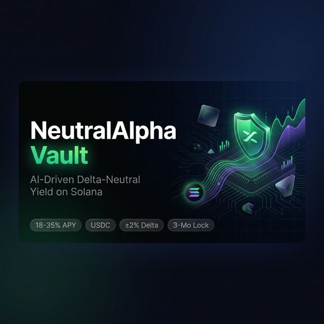
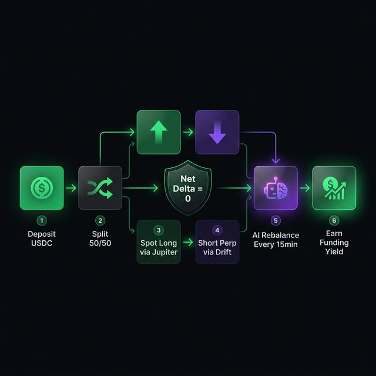
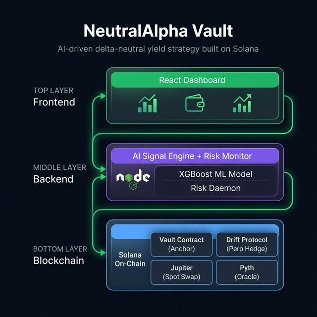

<p align="center">
  
</p>

<p align="center">
  
  
  
  
  
  
</p>

<h1 align="center">
  <br />
  🟢 NeutralAlpha Vault
  <br />
</h1>

<h4 align="center">AI-Driven Delta-Neutral Yield Strategy on Solana</h4>

<p align="center">
  Capture funding rate spread without directional risk. Our AI rebalancing engine<br />
  optimizes positions every 15 minutes for maximum risk-adjusted returns.
</p>

<p align="center">
  <a href="#-quick-start">Quick Start</a> ·
  <a href="#-strategy">Strategy</a> ·
  <a href="#%EF%B8%8F-architecture">Architecture</a> ·
  <a href="#-on-chain-program">On-Chain</a> ·
  <a href="#-risk-management">Risk</a> ·
  <a href="#-api-reference">API</a>
</p>

---

## 📌 Overview

**NeutralAlpha Vault** is a USDC-denominated yield vault on Solana that generates returns through **funding rate arbitrage** with near-zero directional market exposure.

The vault simultaneously holds a **spot long** (via Jupiter) and a **perpetual short** (via Drift Protocol) on the same asset, creating a **delta-neutral position**. When perpetual funding rates are positive (longs pay shorts), the vault earns yield — without being exposed to crypto price movements.

An **AI signal engine** (XGBoost) continuously monitors market conditions every 15 minutes, deciding whether to **hold**, **rebalance**, or **rotate** to a different asset pair (SOL, BTC, ETH) for optimal yield.

| Parameter | Value |
|-----------|-------|
| **Target APY** | 18% – 35% (net of fees) |
| **Base Asset** | USDC |
| **Lock Period** | 3-month rolling |
| **Max Delta Drift** | ±2% of NAV |
| **Rebalance Cadence** | Every 15 minutes |
| **Supported Assets** | SOL-PERP, BTC-PERP, ETH-PERP |
| **Performance Fee** | 10% of yield only |

---

## 💡 Strategy

<p align="center">
  
</p>

### How It Works

```
  ┌──────────────┐     ┌──────────────┐     ┌──────────────┐
  │  1. Deposit   │────▶│  2. Split    │────▶│  3. Position │
  │     USDC      │     │    50/50     │     │    Setup     │
  └──────────────┘     └──────┬───────┘     └──────────────┘
                              │
                    ┌─────────┴─────────┐
                    ▼                   ▼
             ┌────────────┐     ┌────────────┐
             │ Spot Long  │     │ Perp Short │
             │  (Jupiter) │     │  (Drift)   │
             └─────┬──────┘     └──────┬─────┘
                   │                   │
                   └───────┬───────────┘
                           ▼
                  ┌──────────────────┐
                  │  Net Delta ≈ 0   │
                  │  Earn Funding ✨  │
                  └────────┬─────────┘
                           ▼
                  ┌──────────────────┐
                  │  AI Rebalance    │
                  │  Every 15 min 🤖 │
                  └──────────────────┘
```

1. **Deposit USDC** → Vault mints proportional shares representing ownership
2. **Position Setup** → 50% as collateral for Drift short, 50% swapped to spot via Jupiter
3. **Delta Neutralization** → Short position exactly offsets spot — net directional exposure = 0
4. **Earn Funding** → Shorts earn funding payments when rates are positive (~70%+ of the time)
5. **AI Monitoring** → XGBoost model evaluates signals every 15 minutes, outputs `HOLD | REBALANCE | ROTATE_ASSET`
6. **Asset Rotation** → Dynamically rotates to highest-yielding perp pair (SOL, BTC, ETH)
7. **Withdraw** → At maturity (3 months), positions unwound, USDC + earned yield returned

### Yield Projections (Backtested: Mar 2024 – Mar 2025)

| Scenario | Avg Funding (8hr) | Gross APY | Net APY |
|----------|-------------------|-----------|---------|
| 🐻 Bear | 0.005% | ~16% | ~12% |
| 📊 Base | 0.010% | ~27% | **~22%** |
| 🐂 Bull | 0.020% | ~54% | ~42% |

---

## 🏗️ Architecture

<p align="center">
  
</p>

### System Architecture (Detailed)

```
┌──────────────────────────────────────────────────────────────────┐
│                        FRONTEND LAYER                            │
│  React 19 + Vite 7 + TailwindCSS v4 + Framer Motion            │
│                                                                  │
│  ┌─────────┐ ┌───────────┐ ┌──────────┐ ┌───────────────────┐  │
│  │  Hero   │ │ Dashboard │ │ Strategy │ │ Risk Management   │  │
│  └─────────┘ └─────┬─────┘ └──────────┘ └───────────────────┘  │
│  ┌─────────────┐   │   ┌──────────┐ ┌───────────────────────┐  │
│  │ Performance │   │   │  Footer  │ │ Architecture Docs     │  │
│  └─────────────┘   │   └──────────┘ └───────────────────────┘  │
│                    │                                             │
│  ┌─────────────────┴──────────────────────────────────────────┐ │
│  │  Phantom Wallet Context + API Adapter (Live + Fallback)    │ │
│  └────────────────────────────┬────────────────────────────────┘ │
└───────────────────────────────┼──────────────────────────────────┘
                                │ REST API (port 8787)
                                ▼
┌──────────────────────────────────────────────────────────────────┐
│                       BACKEND LAYER                              │
│               Node.js Simulation API Server                      │
│                                                                  │
│  ┌──────────────────┐  ┌───────────────┐  ┌──────────────────┐  │
│  │   AI Signal      │  │  Risk Monitor │  │  Vault Mutation  │  │
│  │   Engine         │  │  Daemon       │  │  Simulator       │  │
│  │                  │  │               │  │                  │  │
│  │ • HOLD           │  │ • Delta check │  │ • Deposit flow   │  │
│  │ • REBALANCE      │  │ • Health ratio│  │ • Withdraw flow  │  │
│  │ • ROTATE_ASSET   │  │ • Drawdown    │  │ • Slippage cap   │  │
│  │                  │  │ • USDC depeg  │  │ • Activity log   │  │
│  └──────────────────┘  └───────────────┘  └──────────────────┘  │
└───────────────────────────────┼──────────────────────────────────┘
                                │ CPI / RPC
                                ▼
┌──────────────────────────────────────────────────────────────────┐
│                      ON-CHAIN LAYER (Solana)                     │
│                                                                  │
│  ┌────────────────────────────────────────────────────────┐      │
│  │          NeutralAlpha Vault (Anchor Program)           │      │
│  │                                                        │      │
│  │  initialize_vault · deposit · withdraw                 │      │
│  │  set_pause · set_emergency_mode · set_rebalance_bot    │      │
│  │  execute_drift_hedge · execute_jupiter_swap            │      │
│  └──┬──────────────┬─────────────────┬────────────────────┘      │
│     │              │                 │                            │
│     ▼              ▼                 ▼                            │
│ ┌────────┐   ┌──────────┐   ┌─────────────┐   ┌──────────────┐ │
│ │ Drift  │   │ Jupiter  │   │ Pyth Oracle │   │ Ranger Earn  │ │
│ │Protocol│   │Aggregator│   │ Price Feeds │   │    SDK       │ │
│ │(Perps) │   │ (Swaps)  │   │             │   │  (Vault)     │ │
│ └────────┘   └──────────┘   └─────────────┘   └──────────────┘ │
└──────────────────────────────────────────────────────────────────┘
```

### Protocol Stack

| Protocol | Role | Integration |
|----------|------|-------------|
| **Solana** | Base layer blockchain | Runtime |
| **Ranger Earn SDK** | Vault framework | Vault lifecycle |
| **Drift Protocol** | Perpetual futures (short positions) | CPI gateway |
| **Jupiter Aggregator** | Spot swaps (best execution) | CPI gateway |
| **Pyth Network** | Oracle price feeds | Delta calculation |
| **Helius** | RPC & WebSocket data streams | Data pipeline |

### Tech Stack

| Layer | Technology |
|-------|-----------|
| **Frontend** | React 19, Vite 7, TailwindCSS v4, Framer Motion, Recharts, Lucide Icons |
| **Backend** | Node.js (pure `node:http`, zero deps), simulation engine |
| **On-Chain** | Rust, Anchor 0.30.1, anchor-spl |
| **Wallet** | Phantom (connect/disconnect/account change events) |
| **Fonts** | Inter (UI), JetBrains Mono (data/code) |

---

## 🚀 Quick Start

### Prerequisites

| Requirement | Version |
|-------------|---------|
| Node.js | 20+ (tested on 24) |
| npm | 10+ |
| Rust + Cargo | Latest stable (for on-chain) |
| Solana CLI | 1.18+ (for on-chain) |
| Anchor CLI | 0.30+ (for on-chain) |

### Installation

```bash
git clone https://github.com/panzauto46-bot/NeutralAlpha-Vault.git
cd NeutralAlpha-Vault
npm install
```

### Run Development Server

**Option A** — Run both API + Web together:

```bash
npm run dev:stack
```

**Option B** — Run separately:

```bash
# Terminal 1: API Server
npm run dev:api

# Terminal 2: Vite Dev Server
npm run dev:web
```

| Service | URL |
|---------|-----|
| 🌐 Web Dashboard | http://localhost:5173 |
| 📡 API Server | http://localhost:8787/api/v1/health |

### Build for Production

```bash
npm run typecheck    # Type check
npm run build        # Production build → dist/
npm run preview      # Preview production build
```

---

## ⛓️ On-Chain Program

### Anchor Program Instructions

| Instruction | Description | Access |
|-------------|-------------|--------|
| `initialize_vault` | Create vault state, PDA accounts, share mint | Admin only |
| `deposit` | Transfer USDC → mint shares → set 3-month lock | Any user |
| `withdraw` | Burn shares → return USDC (lock enforced) | Position owner |
| `set_pause` | Pause/unpause vault operations | Admin only |
| `set_emergency_mode` | Emergency override (bypass lock period) | Admin only |
| `set_rebalance_bot` | Update authorized bot address | Admin only |
| `execute_drift_hedge` | CPI gateway to Drift Protocol | Bot only |
| `execute_jupiter_swap` | CPI gateway to Jupiter Aggregator | Bot only |

### Account Structure

```
┌───────────────────────────────────────────────────┐
│                    VaultState                      │
│                                                   │
│  authority         : Pubkey    (admin)             │
│  rebalance_bot     : Pubkey    (bot signer)        │
│  usdc_mint         : Pubkey    (USDC token)        │
│  usdc_vault        : Pubkey    (vault token acct)  │
│  share_mint        : Pubkey    (LP share token)    │
│  drift_program     : Pubkey    (Drift CPI target)  │
│  jupiter_program   : Pubkey    (Jupiter CPI target)│
│  pyth_price_feed   : Pubkey    (price oracle)      │
│  total_usdc        : u64       (deposited USDC)    │
│  total_shares      : u64       (minted shares)     │
│  lock_period_secs  : i64       (90 days default)   │
│  performance_fee   : u16       (bps, max 2000)     │
│  paused            : bool                          │
│  emergency_mode    : bool                          │
│  reserved          : [u8; 64]  (future fields)     │
└───────────────────────────────────────────────────┘

┌───────────────────────────────────────────────────┐
│                  UserPosition (PDA)                │
│                                                   │
│  owner             : Pubkey    (depositor)         │
│  shares            : u64       (owned shares)      │
│  unlock_ts         : i64       (lock expiry)       │
│  last_deposit_ts   : i64       (last deposit time) │
│  reserved          : [u8; 31]  (future fields)     │
└───────────────────────────────────────────────────┘
```

### PDA Seeds

| Account | Seeds |
|---------|-------|
| `vault_state` | `["vault", usdc_mint]` |
| `vault_authority` | `["vault_authority", vault_state]` |
| `usdc_vault` | `["usdc_vault", vault_state]` |
| `share_mint` | `["share_mint", vault_state]` |
| `user_position` | `["position", vault_state, depositor]` |

### Build & Deploy

```bash
cd onchain
anchor build
anchor deploy --provider.cluster testnet
```

### Vault Client CLI

```bash
npm run vault:accounts                    # List derived accounts
npm run vault:init                        # Initialize vault
npm run vault:deposit -- --amount 1000000 # Deposit 1 USDC (6 decimals)
npm run vault:withdraw -- --shares 1000000 # Withdraw shares
```

---

## 🛡️ Risk Management

### Risk Control Matrix

| Risk | Mitigation | Trigger | Status |
|------|------------|---------|--------|
| **Delta Drift** | Auto-rebalance via AI engine | Delta > ±2% NAV | ✅ Active |
| **Negative Funding** | Asset rotation to best-rate perp | Rate < 0.003% for 2 periods | ✅ Active |
| **Liquidation** | Health ratio > 1.5 maintained | Emergency exit if HR < 1.15 | ✅ Active |
| **Execution Slippage** | Jupiter best-route + 0.3% cap | TX rejected if > 0.3% | ✅ Active |
| **USDC Depeg** | Full unwind trigger | USDC < $0.98 | ✅ Active |
| **Smart Contract** | Audited protocols (Drift, Ranger) | Continuous monitoring | ⚠️ Disclosed |

### Drawdown Controls

| Type | Trigger | Action |
|------|---------|--------|
| 🟡 **Soft Limit** | 5% NAV drop in 7 days | Pause new deposits, alert team |
| 🔴 **Hard Limit** | 10% NAV drop from peak | Full unwind, return USDC |

### Position Limits

| Limit | Value |
|-------|-------|
| Max Single Asset Exposure | 60% of NAV |
| Max Leverage (Drift) | 2x |
| Min Health Ratio | 1.5 (target) |
| Emergency Health Ratio | 1.15 (full unwind) |

---

## 📡 API Reference

**Base URL**: `http://localhost:8787/api/v1`

### Endpoints

| Method | Endpoint | Description |
|--------|----------|-------------|
| `GET` | `/health` | Service heartbeat |
| `GET` | `/contracts` | Risk limits & strategy constraints |
| `GET` | `/dashboard` | Full dashboard snapshot (live metrics) |
| `GET` | `/vault/activity` | Recent vault deposit/withdraw log |
| `POST` | `/vault/deposit` | Simulate USDC deposit |
| `POST` | `/vault/withdraw` | Simulate USDC withdrawal |
| `POST` | `/risk/simulate` | Force risk scenario for testing |

### Dashboard Snapshot Response

```json
{
  "generatedAt": "2026-03-23T00:00:00.000Z",
  "source": "simulated-live",
  "overview": {
    "tvlUsd": 2847392,
    "currentApyPct": 24.8,
    "healthRatio": 1.72,
    "deltaExposurePct": -0.8
  },
  "signal": {
    "action": "HOLD",
    "reason": "Delta and funding are inside target band.",
    "activeAsset": "SOL"
  },
  "liveFunding": { "SOL": 0.0112, "BTC": 0.0089, "ETH": 0.0095 },
  "risk": {
    "depositPaused": false,
    "emergencyState": false,
    "alerts": []
  }
}
```

### Deposit Example

```bash
curl -X POST http://localhost:8787/api/v1/vault/deposit \
  -H "Content-Type: application/json" \
  -d '{"amountUsd": 2500, "wallet": "guest", "slippagePct": 0.1}'
```

---

## 📁 Project Structure

```
NeutralAlpha-Vault/
│
├── 📄 README.md                 # This file
├── 📄 ROADMAP.md                # PRD-aligned milestone plan
├── 📄 package.json              # Dependencies & npm scripts
├── 📄 tsconfig.json             # TypeScript strict config
├── 📄 vite.config.ts            # Vite + React + TailwindCSS v4
├── 📄 index.html                # Entry point (Google Fonts)
│
├── 📁 src/                      # Frontend (React + TypeScript)
│   ├── main.tsx                 # App bootstrap with WalletProvider
│   ├── App.tsx                  # Root component composition
│   ├── index.css                # Design system (glass, gradients, animations)
│   ├── 📁 components/
│   │   ├── Navbar.tsx           # Navigation + Phantom wallet button
│   │   ├── Hero.tsx             # Landing section with key stats
│   │   ├── Dashboard.tsx        # Live metrics, charts, deposit form
│   │   ├── Strategy.tsx         # Delta-neutral strategy explainer
│   │   ├── RiskManagement.tsx   # Risk matrix + drawdown controls
│   │   ├── Performance.tsx      # Yield projections + comparisons
│   │   ├── Architecture.tsx     # Technical stack documentation
│   │   └── Footer.tsx           # Links + social
│   ├── 📁 context/
│   │   └── WalletContext.tsx    # Phantom wallet state management
│   ├── 📁 services/
│   │   ├── dashboardApi.ts      # REST API client (7s timeout)
│   │   └── dashboardFallback.ts # Offline fallback data generator
│   ├── 📁 types/
│   │   ├── dashboard.ts         # TypeScript interfaces
│   │   └── phantom.d.ts         # Phantom wallet type declarations
│   └── 📁 utils/
│       └── cn.ts                # className utility (clsx + twMerge)
│
├── 📁 server/                   # Backend API
│   └── index.mjs                # Node.js risk engine (468 lines, zero deps)
│
├── 📁 onchain/                  # Solana Anchor Program
│   ├── Anchor.toml              # Anchor configuration
│   ├── Cargo.toml               # Rust workspace
│   ├── .env.example             # Environment template
│   ├── README.md                # On-chain documentation
│   └── 📁 programs/neutralalpha_vault/
│       ├── Cargo.toml           # Crate config (anchor-lang 0.30.1)
│       └── 📁 src/
│           └── lib.rs           # Vault program (542 lines)
│
├── 📁 scripts/                  # Tooling & Testing
│   ├── dev-stack.mjs            # Run API + Web simultaneously
│   ├── smoke-e2e.mjs            # E2E smoke tests (7 assertions)
│   ├── testnet-harness.mjs      # Solana testnet transaction harness
│   └── vault-client.mjs         # CLI vault operations (init/deposit/withdraw)
│
├── 📁 docs/                     # Documentation
│   ├── API_CONTRACT.md          # Frozen API specification
│   ├── RUNBOOK.md               # Setup & operations guide
│   ├── ONCHAIN_RUNBOOK.md       # Anchor deploy instructions
│   ├── TESTNET_HARNESS.md       # Testnet harness documentation
│   ├── STATUS_2026-03-22.md     # Daily progress report
│   └── FULL_PROJECT_AUDIT.md    # Comprehensive project audit
│
└── 📁 assets/                   # Static assets
    ├── architecture-diagram.png # System architecture diagram
    └── strategy-flow.png        # Delta-neutral strategy flow
```

---

## 🧪 Testing

```bash
# API E2E smoke test (requires API server running)
npm run test:smoke

# TypeScript type checking
npm run typecheck

# Solana testnet transaction harness
npm run testnet:harness

# Quick health check
curl http://localhost:8787/api/v1/health
```

---

## 🏆 Hackathon

<table>
  <tr>
    <td><strong>Event</strong></td>
    <td>Ranger Build-A-Bear Hackathon 2026 (StableHacks)</td>
  </tr>
  <tr>
    <td><strong>Track</strong></td>
    <td>AI-Driven DeFi Yield Strategy</td>
  </tr>
  <tr>
    <td><strong>Submission</strong></td>
    <td>Solo</td>
  </tr>
  <tr>
    <td><strong>Category</strong></td>
    <td>Delta-Neutral Vault on Solana</td>
  </tr>
</table>

---

## ⚠️ Disclaimer

> This is a hackathon project and proof of concept. DeFi investments carry inherent risks including smart contract vulnerabilities, oracle failures, and extreme market conditions. The vault targets delta-neutrality but cannot guarantee zero directional exposure at all times. Past performance and backtested results do not guarantee future returns. **Only deposit funds you can afford to lose.**

---

## 📄 License

[MIT](./LICENSE)

---

<p align="center">
  Built with 💚 on Solana
</p>
